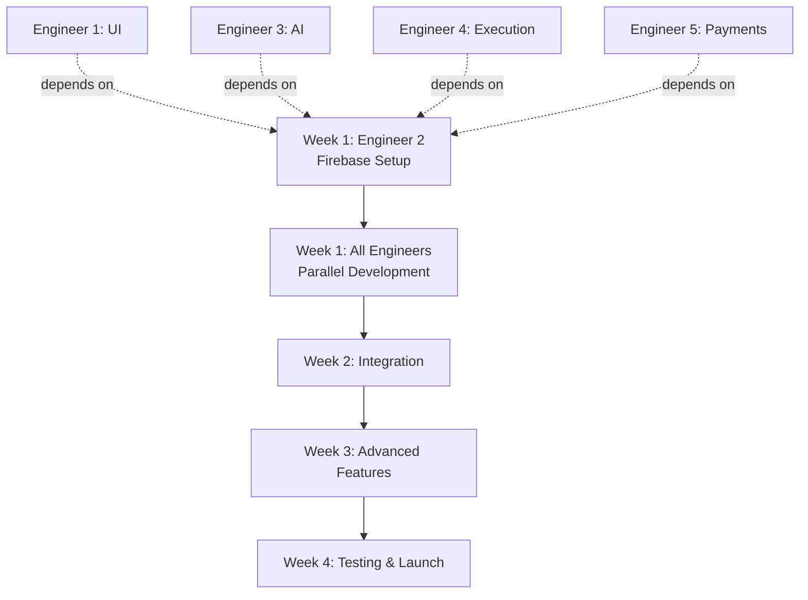

# 并行开发计划 - 多工程师协作

## 团队结构与职责分工

将开发工作分配给 **5个工程师/小组**，实现并行开发，预计可将 8 周的开发周期缩短至 **3-4 周**。

---

## 🎯 工程师角色分工

### 👤 Engineer 1: Frontend UI/UX Lead
**主要职责**: 用户界面、交互设计、前端组件开发

### 🔧 Engineer 2: Backend & Infrastructure Lead
**主要职责**: Firebase、Cloud Functions、数据库架构、API设计

### 🤖 Engineer 3: AI Integration Specialist
**主要职责**: OpenAI集成、语音功能、AI面试逻辑

### ⚡ Engineer 4: Code Execution & Testing Engineer
**主要职责**: 代码执行引擎、测试系统、安全沙箱

### 💳 Engineer 5: Payments & Analytics Engineer
**主要职责**: Stripe集成、订阅管理、数据分析

---

## 📅 并行开发时间线（4周冲刺）

### Week 1: 基础设施与核心功能 🏗️

#### Engineer 1: Frontend Foundation
**任务优先级**: P0 (阻塞其他工作)

- [ ] **Day 1-2**: 项目结构搭建
  ```bash
  - React + Vite 配置
  - TailwindCSS 设置
  - React Router 路由架构
  - 通用 UI 组件库 (Button, Modal, Input)
  ```

- [ ] **Day 3-4**: 认证 UI 组件
  ```bash
  - Login 页面
  - Signup 页面
  - 密码重置流程
  - 表单验证逻辑
  ```

- [ ] **Day 5**: 布局系统
  ```bash
  - Navbar 组件
  - Sidebar 组件
  - 响应式布局框架
  - 页面过渡动画
  ```

**交付物**:
- ✅ 可运行的 React 应用框架
- ✅ 认证 UI 组件（等待后端集成）
- ✅ 设计系统文档

**依赖**: 无
**阻塞**: Engineer 2 (需要 UI 组件来集成认证)

---

#### Engineer 2: Backend Infrastructure
**任务优先级**: P0 (阻塞其他工作)

- [ ] **Day 1-2**: Firebase 项目设置
  ```bash
  - 创建 Firebase 项目 (dev/staging/prod)
  - 配置 Authentication (Email + Google OAuth)
  - 初始化 Firestore 数据库
  - 设置 Firebase Emulator Suite (本地开发)
  ```

- [ ] **Day 3-4**: Firestore 数据架构
  ```javascript
  // 定义所有 Collections
  - users/{userId}
  - sessions/{sessionId}
  - problems/{problemId}
  - subscriptions/{subscriptionId}

  // 编写 Security Rules
  - 用户只能读写自己的数据
  - 问题集只读权限
  ```

- [ ] **Day 5**: Cloud Functions 框架
  ```bash
  - 初始化 Firebase Functions 项目
  - 设置 TypeScript/JavaScript 环境
  - 创建 API 端点模板
  - 设置 CORS 和中间件
  ```

**交付物**:
- ✅ Firebase 项目完全配置
- ✅ Firestore schema + security rules
- ✅ Cloud Functions 开发框架
- ✅ API 文档 (OpenAPI/Swagger)

**依赖**: 无
**阻塞**: 所有其他工程师（基础设施依赖）

---

#### Engineer 3: AI Service Architecture
**任务优先级**: P1 (可与其他工作并行)

- [ ] **Day 1-2**: OpenAI 集成设计
  ```bash
  - 设计 AI 面试官系统 prompt
  - 定义对话流程状态机
  - 设计上下文管理策略
  - 创建 prompt 模板库
  ```

- [ ] **Day 3-4**: AI Service 实现
  ```javascript
  // src/services/openai.js
  - initializeInterview(problem)
  - sendMessage(userMessage, codeContext)
  - generateFeedback(session)
  - generateHint(codeState)
  ```

- [ ] **Day 5**: Mock AI 响应系统
  ```bash
  - 规则引擎用于开发/测试
  - 预定义响应库
  - A/B 测试不同 prompt 策略
  ```

**交付物**:
- ✅ AI 服务接口定义
- ✅ 系统 prompt 文档
- ✅ Mock 实现（无需 API key）

**依赖**: 需要 Engineer 2 的 Cloud Functions 框架
**阻塞**: 无（可用 mock 数据开发）

---

#### Engineer 4: Code Execution Setup
**任务优先级**: P1 (可与其他工作并行)

- [ ] **Day 1-2**: 代码执行方案调研
  ```bash
  - Judge0 API 评估与注册
  - Docker 沙箱方案设计
  - WebContainers 可行性研究
  - 选择初始方案: Judge0 (快速 MVP)
  ```

- [ ] **Day 3-4**: Judge0 集成
  ```javascript
  // Firebase Function: executeCode
  - 提交代码到 Judge0
  - 轮询执行结果
  - 错误处理和超时
  - 语言 ID 映射 (Python, JS, Java)
  ```

- [ ] **Day 5**: 测试用例验证器
  ```javascript
  // src/services/testValidator.js
  - runTestCases(code, testCases)
  - compareOutput(actual, expected)
  - 计算分数和反馈
  ```

**交付物**:
- ✅ 代码执行 API (Judge0)
- ✅ 测试验证服务
- ✅ 执行结果格式规范

**依赖**: Engineer 2 的 Cloud Functions 框架
**阻塞**: 无

---

#### Engineer 5: Analytics Foundation
**任务优先级**: P2 (Week 2 可开始)

- [ ] **Day 1-3**: 数据模型设计
  ```javascript
  // 定义 analytics schema
  - 用户统计数据结构
  - 会话性能指标
  - 问题难度分析
  ```

- [ ] **Day 4-5**: Firebase Analytics 设置
  ```bash
  - 启用 Firebase Analytics
  - 定义自定义事件
  - 设置用户属性
  - 配置转化漏斗
  ```

**交付物**:
- ✅ Analytics 数据模型
- ✅ 事件追踪计划

**依赖**: Engineer 2 的 Firebase 设置
**阻塞**: 无

---

### Week 2: 核心功能开发 🚀

#### Engineer 1: Interview UI Components
**任务优先级**: P0

- [ ] **Day 1-2**: Monaco 编辑器集成
  ```jsx
  // components/Editor/CodeEditor.jsx
  - Monaco Editor 配置
  - 语法高亮
  - 自动完成
  - 多语言支持
  - 主题切换
  ```

- [ ] **Day 2-3**: 终端组件
  ```jsx
  // components/Terminal/Terminal.jsx
  - 输出显示
  - 错误高亮
  - 输入支持
  - 清除功能
  ```

- [ ] **Day 3-4**: 聊天界面
  ```jsx
  // components/Interview/ChatInterface.jsx
  - 消息列表
  - 输入框
  - 语音按钮 (placeholder)
  - 打字指示器
  - 自动滚动
  ```

- [ ] **Day 4-5**: 面试会话主界面
  ```jsx
  // components/Interview/InterviewSession.jsx
  - 分屏布局 (Problem | Editor | Chat)
  - 终端和测试用例面板
  - 计时器
  - 控制按钮 (Run, Submit, End)
  ```

**交付物**:
- ✅ 完整的面试 UI
- ✅ 与后端 API 集成
- ✅ 响应式设计

**依赖**: Engineer 2, 3, 4 的 API
**阻塞**: 用户测试

---

#### Engineer 2: Backend API Development
**任务优先级**: P0

- [ ] **Day 1-2**: 认证 Cloud Functions
  ```javascript
  // functions/auth/
  - onUserCreate.js (创建用户 profile)
  - updateUserProfile.js
  - deleteUserAccount.js
  ```

- [ ] **Day 2-3**: 会话管理 Functions
  ```javascript
  // functions/interviews/
  - startSession.js (初始化面试)
  - saveSessionProgress.js (自动保存)
  - endSession.js (结束并生成反馈)
  - getSessionHistory.js
  ```

- [ ] **Day 3-4**: 问题库 Functions
  ```javascript
  // functions/problems/
  - getRandomProblem.js (按难度)
  - getProblemsByCategory.js
  - seedProblemDatabase.js (初始化问题)
  ```

- [ ] **Day 4-5**: 实时同步
  ```javascript
  // Firestore Listeners
  - 代码自动保存 (debounce 500ms)
  - 聊天消息同步
  - 会话状态更新
  ```

**交付物**:
- ✅ 所有后端 API 端点
- ✅ API 文档更新
- ✅ 单元测试

**依赖**: Week 1 的 Firebase 设置
**阻塞**: Frontend 集成

---

#### Engineer 3: AI Interviewer Logic
**任务优先级**: P0

- [ ] **Day 1-2**: ChatGPT Function
  ```javascript
  // functions/interviews/chatWithAI.js
  - 接收用户消息 + 代码上下文
  - 调用 OpenAI API
  - 管理对话历史
  - 返回 AI 响应
  ```

- [ ] **Day 2-3**: 上下文感知逻辑
  ```javascript
  // 分析代码进度
  - 检测用户是否卡住
  - 识别代码模式和错误
  - 生成个性化提示
  ```

- [ ] **Day 3-4**: 面试流程引擎
  ```javascript
  // 状态机实现
  START → INTRO → CLARIFICATION → CODING →
  TESTING → COMPLEXITY → FEEDBACK

  - 根据阶段调整 AI 行为
  - 触发条件 (时间、代码变化、测试结果)
  ```

- [ ] **Day 4-5**: 反馈生成器
  ```javascript
  // functions/interviews/generateFeedback.js
  - 分析完整会话
  - 评估代码质量
  - 生成结构化反馈
  - 打分 (0-100)
  ```

**交付物**:
- ✅ AI 面试官完整功能
- ✅ Prompt 优化文档
- ✅ 成本估算报告

**依赖**: Engineer 2 的 Cloud Functions
**阻塞**: 前端聊天集成

---

#### Engineer 4: Code Execution & Testing
**任务优先级**: P0

- [ ] **Day 1-2**: 执行引擎优化
  ```javascript
  // functions/interviews/executeCode.js
  - 错误处理改进
  - 超时管理
  - 输出格式化
  - 支持 stdin 输入
  ```

- [ ] **Day 2-3**: 测试运行器
  ```javascript
  // functions/interviews/runTests.js
  - 批量执行测试用例
  - 并发控制
  - 结果聚合
  - 性能指标收集
  ```

- [ ] **Day 3-4**: 安全强化
  ```javascript
  // 沙箱安全措施
  - 恶意代码检测
  - 资源限制监控
  - 输出大小限制
  - 网络隔离验证
  ```

- [ ] **Day 4-5**: 多语言支持
  ```javascript
  // 添加语言支持
  - JavaScript (Node.js)
  - Java
  - C++
  - 为每种语言创建测试套件
  ```

**交付物**:
- ✅ 生产级代码执行服务
- ✅ 完整测试覆盖
- ✅ 安全审计报告

**依赖**: Week 1 的 Judge0 集成
**阻塞**: 前端测试面板集成

---

#### Engineer 5: Problem Bank & Data
**任务优先级**: P1

- [ ] **Day 1-3**: 问题库扩展
  ```javascript
  // 创建 50+ 问题
  - Easy: 20 题
  - Medium: 20 题
  - Hard: 10 题

  // 每题包含:
  - 描述、示例、约束
  - 测试用例 (公开 + 隐藏)
  - 起始代码模板
  - 提示
  ```

- [ ] **Day 3-4**: 数据库种子
  ```javascript
  // scripts/seedDatabase.js
  - 将问题导入 Firestore
  - 添加公司标签
  - 分类索引
  ```

- [ ] **Day 4-5**: 数据验证
  ```javascript
  // 验证所有测试用例
  - 运行所有问题的测试
  - 确保正确答案通过
  - 标记边界案例
  ```

**交付物**:
- ✅ 50+ 高质量问题
- ✅ 数据库种子脚本
- ✅ 问题质量报告

**依赖**: Engineer 4 的测试运行器
**阻塞**: 无

---

### Week 3: 高级功能与集成 🎙️

#### Engineer 1: Dashboard & History
**任务优先级**: P1

- [ ] **Day 1-2**: Dashboard 完善
  ```jsx
  // components/Dashboard/Dashboard.jsx
  - 用户统计卡片
  - 最近会话列表
  - 进度图表 (Chart.js / Recharts)
  - 快速操作按钮
  ```

- [ ] **Day 2-3**: 会话历史页面
  ```jsx
  // components/Dashboard/SessionHistory.jsx
  - 分页列表
  - 筛选和排序
  - 搜索功能
  - 详情模态框
  ```

- [ ] **Day 3-4**: 会话回放
  ```jsx
  // components/Dashboard/SessionReplay.jsx
  - 代码播放时间轴
  - 聊天记录同步
  - 测试结果显示
  ```

- [ ] **Day 4-5**: Analytics 可视化
  ```jsx
  // components/Dashboard/Analytics.jsx
  - 分数趋势图
  - 问题分类饼图
  - 强弱项分析雷达图
  ```

**交付物**:
- ✅ 完整的用户面板
- ✅ 会话管理功能
- ✅ 数据可视化

**依赖**: Engineer 5 的 analytics 数据
**阻塞**: 无

---

#### Engineer 2: Real-time Features
**任务优先级**: P1

- [ ] **Day 1-2**: Firestore 实时监听器
  ```javascript
  // 实时数据同步
  - 代码变更监听 (onSnapshot)
  - 聊天消息推送
  - 会话状态更新
  - 冲突解决策略
  ```

- [ ] **Day 2-3**: 性能优化
  ```javascript
  // 优化 Firestore 查询
  - 添加复合索引
  - 数据分页
  - 缓存策略
  - 批量写入优化
  ```

- [ ] **Day 3-5**: 部署准备
  ```bash
  - 设置生产环境变量
  - 配置 Firebase Hosting
  - 部署 Cloud Functions
  - 设置 CI/CD (GitHub Actions)
  ```

**交付物**:
- ✅ 实时功能完整
- ✅ 性能优化完成
- ✅ 部署流程文档

**依赖**: 无
**阻塞**: 生产部署

---

#### Engineer 3: Voice Integration 🎙️
**任务优先级**: P1 (可选，Phase 5)

- [ ] **Day 1-2**: Speech-to-Text
  ```javascript
  // functions/voice/transcribeAudio.js
  - 接收音频 blob
  - 上传到 Firebase Storage
  - 调用 Whisper API
  - 返回文本转录
  ```

- [ ] **Day 2-3**: Text-to-Speech
  ```javascript
  // functions/voice/generateSpeech.js
  - 接收 AI 响应文本
  - 调用 OpenAI TTS API
  - 缓存音频文件
  - 返回音频 URL
  ```

- [ ] **Day 3-4**: 前端语音 UI
  ```jsx
  // components/Interview/VoiceControls.jsx
  - 录音按钮 (MediaRecorder API)
  - 音频播放器
  - 音量可视化
  - 麦克风权限处理
  ```

- [ ] **Day 4-5**: 语音工作流集成
  ```javascript
  // 完整语音循环
  User speaks → STT → GPT → TTS → Play audio

  - 状态管理
  - 错误处理
  - 降级到文本模式
  ```

**交付物**:
- ✅ 完整语音功能
- ✅ 成本分析
- ✅ 用户体验测试

**依赖**: Week 2 的聊天功能
**阻塞**: 无（可选功能）

---

#### Engineer 4: Security & Testing
**任务优先级**: P0

- [ ] **Day 1-2**: 安全审计
  ```bash
  - 代码注入测试
  - XSS 漏洞扫描
  - SQL/NoSQL 注入检查
  - API 限流测试
  ```

- [ ] **Day 2-3**: 单元测试
  ```javascript
  // Jest + React Testing Library
  - 组件测试 (70% 覆盖率)
  - Service 测试
  - Hook 测试
  - Mock Firebase/OpenAI
  ```

- [ ] **Day 3-4**: 集成测试
  ```javascript
  // 端到端流程
  - 注册/登录流程
  - 完整面试会话
  - 代码执行
  - 支付流程 (模拟)
  ```

- [ ] **Day 4-5**: 负载测试
  ```bash
  - 并发用户测试
  - 代码执行队列
  - Firestore 写入限制
  - API 响应时间
  ```

**交付物**:
- ✅ 安全报告
- ✅ 测试覆盖率 >70%
- ✅ 性能基准

**依赖**: 所有核心功能完成
**阻塞**: 生产发布

---

#### Engineer 5: Stripe Integration 💳
**任务优先级**: P0 (Phase 7)

- [ ] **Day 1-2**: Stripe 设置
  ```bash
  - 创建 Stripe 账户 (dev/prod)
  - 创建产品:
    - Monthly: $20/month
    - Annual: $200/year
  - 配置 webhook
  ```

- [ ] **Day 2-3**: Checkout 流程
  ```javascript
  // functions/payments/createCheckoutSession.js
  - 创建 Stripe session
  - 重定向到 Checkout
  - 处理成功/取消回调
  ```

- [ ] **Day 3-4**: 订阅管理
  ```javascript
  // functions/payments/
  - webhookHandler.js (处理 Stripe 事件)
  - cancelSubscription.js
  - updatePaymentMethod.js
  ```

- [ ] **Day 4-5**: 前端集成
  ```jsx
  // components/Subscription/
  - PricingPage.jsx
  - CheckoutForm.jsx
  - SubscriptionManager.jsx
  ```

**交付物**:
- ✅ 完整支付流程
- ✅ Webhook 处理
- ✅ 订阅管理 UI

**依赖**: Engineer 2 的 Cloud Functions
**阻塞**: 收入生成

---

### Week 4: 测试、优化与发布 🚢

#### 所有工程师: 协作完成

#### Phase 4.1: Bug Bash (Day 1-2)
**所有工程师一起**
- [ ] 手动测试所有功能
- [ ] 创建 bug 报告
- [ ] 优先级排序
- [ ] 分配修复任务

#### Phase 4.2: 性能优化 (Day 2-3)
**分工优化**
- Engineer 1: 前端性能 (代码分割、懒加载)
- Engineer 2: 后端性能 (查询优化、缓存)
- Engineer 3: AI 响应速度 (prompt 优化、缓存)
- Engineer 4: 执行速度 (并发、队列优化)
- Engineer 5: 分析性能 (数据聚合优化)

#### Phase 4.3: 文档 (Day 3-4)
**每人负责自己领域**
- Engineer 1: 用户指南、UI 文档
- Engineer 2: API 文档、部署指南
- Engineer 3: AI prompt 指南
- Engineer 4: 代码执行文档、安全指南
- Engineer 5: 数据模型、analytics 文档

#### Phase 4.4: 部署 (Day 4-5)
**协作部署**
- [ ] Staging 环境测试
- [ ] 生产环境部署
- [ ] Smoke 测试
- [ ] 监控设置 (Sentry, Firebase Analytics)
- [ ] Beta 用户邀请

---

## 🔗 依赖关系图



---

## 📊 每周交付物检查清单

### Week 1 End
- [ ] ✅ Firebase 完全配置 (Engineer 2)
- [ ] ✅ 认证 UI 完成 (Engineer 1)
- [ ] ✅ AI 服务接口定义 (Engineer 3)
- [ ] ✅ Judge0 集成 (Engineer 4)
- [ ] ✅ Analytics 基础 (Engineer 5)

### Week 2 End
- [ ] ✅ 完整面试 UI (Engineer 1)
- [ ] ✅ 所有后端 API (Engineer 2)
- [ ] ✅ AI 面试官功能 (Engineer 3)
- [ ] ✅ 代码执行服务 (Engineer 4)
- [ ] ✅ 50+ 问题库 (Engineer 5)

### Week 3 End
- [ ] ✅ Dashboard & History (Engineer 1)
- [ ] ✅ 实时同步 (Engineer 2)
- [ ] ✅ 语音功能 (Engineer 3) - 可选
- [ ] ✅ 安全测试 (Engineer 4)
- [ ] ✅ 支付集成 (Engineer 5)

### Week 4 End
- [ ] ✅ 所有 bug 修复
- [ ] ✅ 性能优化完成
- [ ] ✅ 文档齐全
- [ ] ✅ 生产部署
- [ ] ✅ Beta 测试启动

---

## 🛠️ 协作工具与流程

### 代码协作
```bash
# Git 分支策略
main                    # 生产分支
├── develop            # 开发主分支
    ├── feature/engineer1-ui-components
    ├── feature/engineer2-backend-api
    ├── feature/engineer3-ai-integration
    ├── feature/engineer4-code-execution
    └── feature/engineer5-payments

# 每日合并到 develop
# 每周五合并到 main (release)
```

### 每日 Standup
- 时间: 每天早上 10:00
- 格式:
  - 昨天完成了什么？
  - 今天计划做什么？
  - 有什么阻塞？

### API 接口协议
```javascript
// 所有 API 在 Week 1 定义好接口
// 使用 Mock 数据进行前后端并行开发

// 示例: API Contract
POST /api/interviews/startSession
Request: { userId, difficulty, category }
Response: { sessionId, problem, starterCode }
```

### 共享文档
- **API 文档**: Swagger/OpenAPI (实时更新)
- **数据模型**: Firestore schema 文档
- **设计系统**: Figma/Storybook
- **任务看板**: Jira/Linear/GitHub Projects

---

## 🚀 加速开发的最佳实践

### 1. Mock-First Development
所有 API 先定义接口，使用 mock 数据开发，后续替换真实实现。

```javascript
// 示例: Mock OpenAI Service
export const openAIService = {
  sendMessage: async (msg, code) => {
    if (process.env.NODE_ENV === 'development') {
      return mockResponse(msg); // 立即返回 mock
    }
    return await callRealOpenAI(msg, code); // 生产调用真实 API
  }
};
```

### 2. Feature Flags
使用功能开关来控制新功能上线。

```javascript
// Firebase Remote Config
const FEATURES = {
  voiceEnabled: false,    // Week 3 启用
  paymentsEnabled: false, // Week 4 启用
  analyticsEnabled: true
};
```

### 3. Automated Testing
每个 PR 必须通过 CI 测试才能合并。

```yaml
# .github/workflows/ci.yml
- Run linter
- Run unit tests
- Run integration tests
- Build check
```

### 4. Code Review 流程
- Engineer 1 review Engineer 2 的代码
- Engineer 2 review Engineer 3 的代码
- Engineer 3 review Engineer 4 的代码
- Engineer 4 review Engineer 5 的代码
- Engineer 5 review Engineer 1 的代码

交叉 review 确保代码质量和知识共享。

---

## 📈 成功指标

### 开发速度
- 从 8 周 → **4 周** (50% 提速)
- 每周至少 1 次 demo 给 stakeholders

### 代码质量
- 测试覆盖率 >70%
- 0 个 P0/P1 安全漏洞
- 代码 review 在 24 小时内完成

### 团队协作
- 每日 standup 参与率 100%
- 阻塞问题在 1 天内解决
- 跨团队依赖提前 1 周沟通

---

## ⚠️ 风险管理

### 常见阻塞 & 解决方案

| 风险 | 影响 | 缓解策略 |
|------|------|----------|
| Firebase 配置延迟 | 阻塞所有工程师 | Week 1 Day 1 优先完成 |
| OpenAI API 成本过高 | 预算超支 | 使用 GPT-3.5-turbo，添加缓存 |
| Judge0 不稳定 | 影响核心功能 | 准备 Docker 备选方案 |
| 工程师请假/离职 | 进度延迟 | 代码文档化，交叉培训 |
| 技术债务积累 | 后期维护困难 | 每周 1 天 refactor time |

---

## 🎯 总结

通过这个并行开发计划：

✅ **时间缩短**: 8 周 → 4 周
✅ **效率提升**: 5 个工程师并行工作
✅ **风险降低**: 清晰的依赖关系和阻塞管理
✅ **质量保证**: 持续测试和代码 review
✅ **灵活性**: 可选功能（语音）可以后续添加

每个工程师都有清晰的职责和时间线，同时保持团队协作和沟通！🚀
